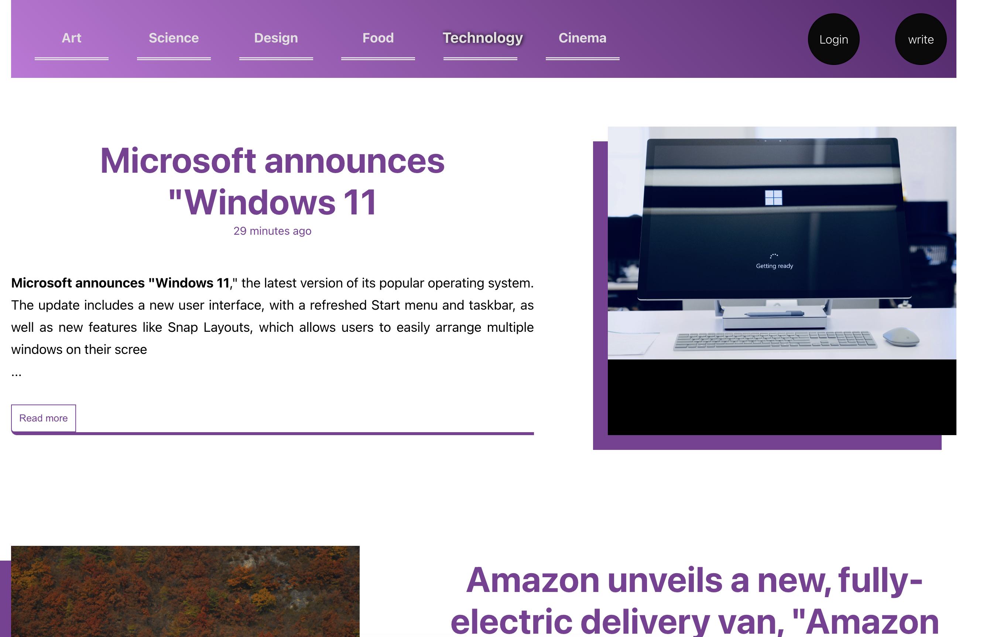

## blogger

Blogger is a socila media application that allows you to create and account, write a blog, upload image and publish you blog based on blog category,eg Science, technology, arts etc.
user are able to modify there own project that they themselve wrote 

#### Technology
        - node express
        - crypto
        - React
        - Posgress Sql
        - Html
        - SCSS
#### Architecture 

Front End (React, Javascript, Html,scss) >> API node express >> Storage Postgress Sql

## Images

#### Login Page

#### Home Page

#### Create a New Blog

#### Edit a Blog

#### Read Blog

